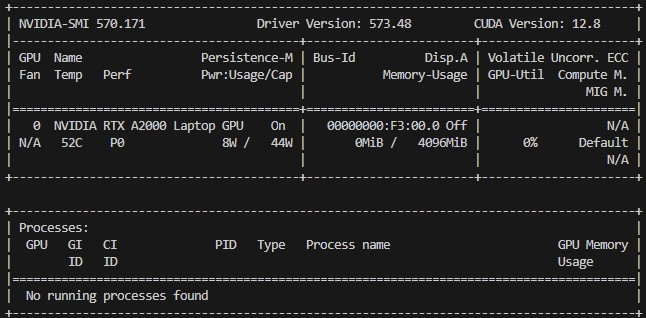

# Prerequirements
Before installing the software, ensure you have the following prerequisites:

- **Host System**: 
    - **WSL 2 using Ubuntu 24.04-1**: Code is currently tested only on this configuration with GPU support enabled.
    - **Nvidia driver**: Ensure you have the NVIDIA driver installed version **>=573.48**. The code has been tested with driver version [573.48](https://www.nvidia.com/en-us/drivers/details/249928/).
    - **CUDA Version**: the code has been tested with CUDA versions **12.4**. CUDA software is installed alongside with the NVIDIA driver, so you do not need to install it separately.
- **Host Hardware**: 
    - An NVIDIA GPU that supports CUDA. The code has been verified on NVIDIA RTX A2000 (4GB) Laptop GPU.
    - At least 32GB of RAM is recommended for running the code efficiently.
- **WSL 2 Software**:   
    - The [CUDA Toolkit](https://developer.nvidia.com/cuda-toolkit-archive) is needed to compile certain submodules. The code has been tested with CUDA Toolkit 12.4.  
    - Python version 3.12 is required.

## Check NVIDIA Driver and CUDA Version
To check if the NVIDIA driver and CUDA version are correctly installed, run the following commands in your WSL terminal:

```bash
nvidia-smi
```
the rusult should be similar to this:



Your cuda version should be **12.4** or higher.

## Install CUDA Toolkit on WSL 2
Be sure you have the HOST Hardware and software prerequisites installed before proceeding.
To install the CUDA Toolkit on WSL 2, run the following commands in your WSL terminal:

```bash
wget https://developer.download.nvidia.com/compute/cuda/repos/wsl-ubuntu/x86_64/cuda-wsl-ubuntu.pin
sudo mv cuda-wsl-ubuntu.pin /etc/apt/preferences.d/cuda-repository-pin-600
wget https://developer.download.nvidia.com/compute/cuda/12.4.0/local_installers/cuda-repo-wsl-ubuntu-12-4-local_12.4.0-1_amd64.deb
sudo dpkg -i cuda-repo-wsl-ubuntu-12-4-local_12.4.0-1_amd64.deb
sudo cp /var/cuda-repo-wsl-ubuntu-12-4-local/cuda-*-keyring.gpg /usr/share/keyrings/
sudo apt-get update
wget http://security.ubuntu.com/ubuntu/pool/universe/n/ncurses/libtinfo5_6.3-2ubuntu0.1_amd64.deb
sudo apt install ./libtinfo5_6.3-2ubuntu0.1_amd64.deb
sudo apt-get -y install cuda-toolkit-12-4
```

Now you need to add the CUDA Toolkit to your PATH. You can the following commands in your WSL terminal:

```bash
export PATH=${PATH}:/usr/local/cuda-12.4/bin
export LD_LIBRARY_PATH=${LD_LIBRARY_PATH}:/usr/local/cuda-12.4/lib64
```

Check if the CUDA Toolkit is correctly installed by running the following command in your WSL terminal:

```bash
nvcc --version  
```

## Prepare the Environment

Create the new environment for the project. You can use venv for this purpose.
From the root of the project, run the following commands in your WSL terminal:

```bash
sudo apt-get update
sudo apt install python3.12-venv python3-dev python3-pip
python3 -m venv .venv
source .venv/bin/activate
```

# Install the Requirements
After preparing the environment, you need to install the required Python packages.

## Upgrade pip

Before installing the requirements, ensure that you have the latest version of pip. Run the following command in your WSL terminal:

```bash
pip install -U pip setuptools wheel
```

## PyTorch Installation
PyTorch is a deep learning framework that is required for running the code. it has strong dependencies on CUDA and cuDNN libraries and requires specific versions to work correctly with the installed CUDA Toolkit.

As we installed CUDA Toolkit 12.8 and the CUDA version is 12.8, we need to install the proper version of PyTorch. as reported in the [PyTorch documentation](https://pytorch.org/get-started/locally/), the PyTorch version that is compatible with CUDA 12.4 is **2.5.1**.

To install PyTorch, run the following command in your WSL terminal:

```bash
pip install torch==2.5.1 torchvision==0.20.1 torchaudio==2.5.1 --index-url https://download.pytorch.org/whl/cu124
```
To test if PyTorch is correctly installed, run the following command in your WSL terminal:

```bash
python ./test_pytorch.py
```
If the installation is successful, you should see the version of PyTorch printed in the terminal.


## Basic dependancies

After installing PyTorch, you need to install the basic dependencies required for the project. Run the following command in your WSL terminal:

```bash
pip install pillow imageio imageio-ffmpeg tqdm easydict opencv-python-headless scipy ninja rembg onnxruntime trimesh open3d xatlas pyvista pymeshfix igraph transformers

pip install git+https://github.com/EasternJournalist/utils3d.git@9a4eb15e4021b67b12c460c7057d642626897ec8
```
## XFormers Installation
XFormers is an optional dependency that can significantly speed up the training process. it has strong dependencies on CUDA and cuDNN libraries and requires specific versions to work correctly with the installed CUDA Toolkit.

```bash
pip install xformers==v0.0.28.post3 --index-url https://download.pytorch.org/whl/cu124
```

## Kaolin Installation (TODO - NOT WORKING YET)
Kaolin is a library that provides tools for working with 3D data in PyTorch.
for PyTorch 2.5.1 and CUDA 12.4, you need to build from the source using this [instructions](https://kaolin.readthedocs.io/en/latest/notes/installation.html) and this [Link](https://github.com/NVIDIAGameWorks/kaolin/issues/897#issuecomment-2914439465)

To install Kaolin, run the following command in your WSL terminal:

```bash
pip install kaolin==0.17.0 -f https://nvidia-kaolin.s3.us-east-2.amazonaws.com/torch-2.5.1_cu124.html
```

## FlashAttention Installation
FlashAttention is an algorithm that reorders the attention computation and leverages tiling and recomputation to significantly speed it up and reduce memory usage from quadratic to linear in sequence length.

Based on the GPU Architecture you have, you need to install the proper version of Flash Attention.
For NVIDIA RTX A2000 (4GB) Laptop GPU based on NVIDIA **Ampere** architecture, you need to install FlashAttention-2.

- Ampere, Ada, and Hopper GPUs are supported by FlashAttention-2.
- Turing and Volta GPUs are supported by FlashAttention-1.

To install FlashAttention-2, run the following command in your WSL terminal:

```bash
pip install flash-attn==2.8.1 --no-build-isolation
```

## Nvdiffrast Installation
Nvdiffrast is a PyTorch/TensorFlow library that provides high-performance primitive operations for rasterization-based differentiable rendering.

To install Nvdiffrast, run the following command in your WSL terminal:

```bash
mkdir -p /tmp/extensions
git clone https://github.com/NVlabs/nvdiffrast.git /tmp/extensions/nvdiffrast
pip install /tmp/extensions/nvdiffrast
```

## Additional Libraries

### diffoctreerast

```bash
mkdir -p /tmp/extensions
git clone --recurse-submodules https://github.com/JeffreyXiang/diffoctreerast.git /tmp/extensions/diffoctreerast
pip install /tmp/extensions/diffoctreerast
```

### Mip-Splatting
```bash
mkdir -p /tmp/extensions
git clone https://github.com/autonomousvision/mip-splatting.git /tmp/extensions/mip-splatting
pip install /tmp/extensions/mip-splatting/submodules/diff-gaussian-rasterization/
```

### VOX2SEQ 
```bash
mkdir -p /tmp/extensions
cp -r extensions/vox2seq /tmp/extensions/vox2seq
pip install /tmp/extensions/vox2seq
```

### SPCONV (MISSING CUDA 12.8 Package - Installed from Comfy3d)
```bash
pip install spconv-cu128
```

### Demo
```bash
pip install spconv-cu128
```
