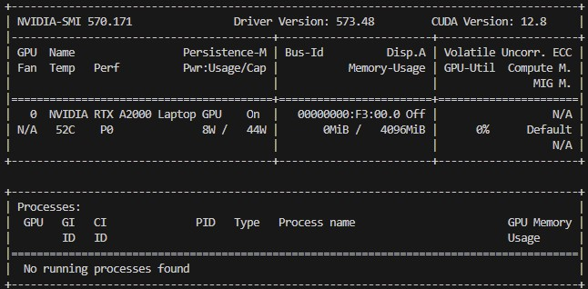

<h1 align="center">Trellis Model<br>Install and host the models on WSL 2 Ubuntu 24.04</h1>
<p align="center">
<a href='https://huggingface.co/spaces/Microsoft/TRELLIS'></a>

<span style="font-size: 16px; font-weight: 600;"></span><span style="font-size: 12px; font-weight: 700;">TRELLIS</span> is a large 3D asset generation model. It takes in text or image prompts and generates high-quality 3D assets in various formats, such as Radiance Fields, 3D Gaussians, and meshes. The cornerstone of <span style="font-size: 16px; font-weight: 600;">T</span><span style="font-size: 12px; font-weight: 700;">RELLIS</span> is a unified Structured LATent (<span style="font-size: 16px; font-weight: 600;">SL</span><span style="font-size: 12px; font-weight: 700;">AT</span>) representation that allows decoding to different output formats and Rectified Flow Transformers tailored for <span style="font-size: 16px; font-weight: 600;">SL</span><span style="font-size: 12px; font-weight: 700;">AT</span> as the powerful backbones. We provide large-scale pre-trained models with up to 2 billion parameters on a large 3D asset dataset of 500K diverse objects. <span style="font-size: 16px; font-weight: 600;">T</span><span style="font-size: 12px; font-weight: 700;">RELLIS</span> significantly surpasses existing methods, including recent ones at similar scales, and showcases flexible output format selection and local 3D editing capabilities which were not offered by previous models.

<!-- Features -->
# 🌟 Features
- **High Quality**: It produces diverse 3D assets at high quality with intricate shape and texture details.
- **Versatility**: It takes text or image prompts and can generate various final 3D representations including but not limited to *Radiance Fields*, *3D Gaussians*, and *meshes*, accommodating diverse downstream requirements.
- **Flexible Editing**: It allows for easy editings of generated 3D assets, such as generating variants of the same object or local editing of the 3D asset.

<!-- Updates -->
# ⏩ Updates

**07/22/2025**
- Install instruction updated to run on WSL 2 Ubuntu 24.04.
- Updated binaries to run on CUDA 12.4 and Python 3.12.3
- Fork of the original repository to support the new setup.


<!-- Installation -->
# 📦 Installation

## Pre-requirements

Before installing the software, ensure you have the following prerequisites:

- **Host Hardware**: 
    - A **NVIDIA GPU that supports CUDA**. The code has been verified on NVIDIA RTX A2000 (4GB) Laptop GPU.
    - At least **32GB** of RAM is recommended for running the code efficiently.
- **Host Software**: 
    - **WSL 2 using Ubuntu 24.04-1**: Code is currently tested only on this configuration with GPU support enabled.
    - **Nvidia driver**: Ensure you have the NVIDIA driver installed version **>=573.48**. The code has been tested with driver version [573.48](https://www.nvidia.com/en-us/drivers/details/249928/).
    - **CUDA Version**: the code has been tested with CUDA versions **12.4**. CUDA software is installed alongside with the NVIDIA driver, so you do not need to install it separately.
- **WSL 2 Software**:   
    - The [CUDA Toolkit](https://developer.nvidia.com/cuda-toolkit-archive) is needed to compile certain submodules. The code has been tested with **CUDA Toolkit 12.4**.
    - Installation is tested on WSL 2 Ubuntu 24.04-1 Vanilla. We are **not using Conda** so a clean image is highly recommended.
    - Python version **3.12** is required.

### Check NVIDIA Driver and CUDA Version on the HOST
To check if the NVIDIA driver and CUDA version are correctly installed, run the following commands in your WSL terminal:

```bash
nvidia-smi
```
the rusult should be similar to this:



Your cuda version should be **12.4** or higher.

## Clone the Repository

As there is submodules in the project, you need to clone the repository with submodules.

To clone the repository, run the following command in your WSL terminal:

```bash
git clone --recurse-submodules https://github.com/francesco-sodano/trellis
cd trellis
```

## Installation Steps

### Install CUDA Toolkit on WSL 2
Be sure you have the HOST Hardware and software prerequisites installed before proceeding.
To install the CUDA Toolkit on WSL 2, run the following commands in your WSL terminal:

```bash
wget https://developer.download.nvidia.com/compute/cuda/repos/wsl-ubuntu/x86_64/cuda-wsl-ubuntu.pin
sudo mv cuda-wsl-ubuntu.pin /etc/apt/preferences.d/cuda-repository-pin-600
wget https://developer.download.nvidia.com/compute/cuda/12.4.0/local_installers/cuda-repo-wsl-ubuntu-12-4-local_12.4.0-1_amd64.deb
sudo dpkg -i cuda-repo-wsl-ubuntu-12-4-local_12.4.0-1_amd64.deb
sudo cp /var/cuda-repo-wsl-ubuntu-12-4-local/cuda-*-keyring.gpg /usr/share/keyrings/
sudo apt-get update
wget http://security.ubuntu.com/ubuntu/pool/universe/n/ncurses/libtinfo5_6.3-2ubuntu0.1_amd64.deb
sudo apt install ./libtinfo5_6.3-2ubuntu0.1_amd64.deb
sudo apt-get -y install cuda-toolkit-12-4
```

Now you need to add the CUDA Toolkit to your PATH. You can the following commands in your WSL terminal:

```bash
export PATH=${PATH}:/usr/local/cuda-12.4/bin
export LD_LIBRARY_PATH=${LD_LIBRARY_PATH}:/usr/local/cuda-12.4/lib64
```

Check if the CUDA Toolkit is correctly installed by running the following command in your WSL terminal:

```bash
nvcc --version  
```
### Prepare the Environment

Create the new environment for the project. You can use venv for this purpose.
From the root of the project, run the following commands in your WSL terminal:

```bash
sudo apt-get update
sudo apt install python3.12-venv python3-dev python3-pip
python3 -m venv .venv
source .venv/bin/activate
```

### Install the Requirements
After preparing the environment, you need to install the required Python packages.

### Upgrade pip

Before installing the requirements, ensure that you have the latest version of pip. Run the following command in your WSL terminal:

```bash
pip install -U pip setuptools wheel
```

### Install libtinfo5

As of Ubuntu 24.04, the `libtinfo5` package is not installed by default.
To install it, run the following command in your WSL terminal:

```bash
sudo apt update
wget http://security.ubuntu.com/ubuntu/pool/universe/n/ncurses/libtinfo5_6.3-2ubuntu0.1_amd64.deb
sudo apt install ./libtinfo5_6.3-2ubuntu0.1_amd64.deb
```

### PyTorch Installation
PyTorch is a deep learning framework that is required for running the code. it has strong dependencies on CUDA and cuDNN libraries and requires specific versions to work correctly with the installed CUDA Toolkit.

As we installed CUDA Toolkit 12.8 and the CUDA version is 12.8, we need to install the proper version of PyTorch. as reported in the [PyTorch documentation](https://pytorch.org/get-started/locally/), the PyTorch version that is compatible with CUDA 12.4 is **2.5.1**.

To install PyTorch, run the following command in your WSL terminal:

```bash
pip install torch==2.5.1 torchvision==0.20.1 torchaudio==2.5.1 --index-url https://download.pytorch.org/whl/cu124
```
To test if PyTorch is correctly installed, run the following command in your WSL terminal:

```bash
python ./tests/test_pytorch.py
```
If the installation is successful, you should see the version of PyTorch printed in the terminal.

the result should be similar to this:


### Basic dependencies

After installing PyTorch, you need to install the basic dependencies required for the project. Run the following command in your WSL terminal:

```bash
pip install pillow imageio imageio-ffmpeg tqdm easydict opencv-python-headless scipy ninja rembg onnxruntime trimesh open3d xatlas pyvista pymeshfix igraph transformers

pip install git+https://github.com/EasternJournalist/utils3d.git@9a4eb15e4021b67b12c460c7057d642626897ec8
```
### XFormers Installation
XFormers is an optional dependency that can significantly speed up the training process. it has strong dependencies on CUDA and cuDNN libraries and requires specific versions to work correctly with the installed CUDA Toolkit.

```bash
pip install xformers==v0.0.28.post3 --index-url https://download.pytorch.org/whl/cu124
```

### Kaolin Installation
Kaolin is a library that provides tools for working with 3D data in PyTorch.

To install Kaolin, run the following command in your WSL terminal:

```bash
pip install kaolin==0.17.0 -f https://nvidia-kaolin.s3.us-east-2.amazonaws.com/torch-2.5.1_cu124.html
```

Note: the Kaolin library requires numpy version **1.26.4** during the installation this will unninstall numpy version **2.1.2**. that is expected.

### FlashAttention Installation
FlashAttention is an algorithm that reorders the attention computation and leverages tiling and recomputation to significantly speed it up and reduce memory usage from quadratic to linear in sequence length.

Based on the GPU Architecture you have, you need to install the proper version of Flash Attention.
For NVIDIA RTX A2000 (4GB) Laptop GPU based on NVIDIA **Ampere** architecture, you need to install FlashAttention-2.

- Ampere, Ada, and Hopper GPUs are supported by FlashAttention-2.
- Turing and Volta GPUs are supported by FlashAttention-1.

To install FlashAttention-2, run the following command in your WSL terminal:

```bash
MAX_JOBS=2 pip install flash-attn --no-build-isolation
```

### Nvdiffrast Installation

Nvdiffrast is a PyTorch/TensorFlow library that provides high-performance primitive operations for rasterization-based differentiable rendering.
To install Nvdiffrast, run the following command in your WSL terminal:

```bash
mkdir -p /tmp/extensions
git clone https://github.com/NVlabs/nvdiffrast.git /tmp/extensions/nvdiffrast
pip install /tmp/extensions/nvdiffrast
```

### Diffoctreerast

```bash
mkdir -p /tmp/extensions
git clone --recurse-submodules https://github.com/JeffreyXiang/diffoctreerast.git /tmp/extensions/diffoctreerast
pip install /tmp/extensions/diffoctreerast
```

### Mip-Splatting
```bash
mkdir -p /tmp/extensions
git clone https://github.com/autonomousvision/mip-splatting.git /tmp/extensions/mip-splatting
pip install /tmp/extensions/mip-splatting/submodules/diff-gaussian-rasterization/
```

### VOX2SEQ 
```bash
mkdir -p /tmp/extensions
cp -r extensions/vox2seq /tmp/extensions/vox2seq
pip install /tmp/extensions/vox2seq
```

### SPCONV
```bash
pip install spconv-cu124
```

## Pretrained Models Location

TRELLIS provide the following pretrained models:

| Model | Description | #Params | Download |
| --- | --- | --- | --- |
| TRELLIS-image-large | Large image-to-3D model | 1.2B | [Download](https://huggingface.co/microsoft/TRELLIS-image-large) |
| TRELLIS-text-base | Base text-to-3D model | 342M | [Download](https://huggingface.co/microsoft/TRELLIS-text-base) |
| TRELLIS-text-large | Large text-to-3D model | 1.1B | [Download](https://huggingface.co/microsoft/TRELLIS-text-large) |
| TRELLIS-text-xlarge | Extra-large text-to-3D model | 2.0B | [Download](https://huggingface.co/microsoft/TRELLIS-text-xlarge) |

The models are hosted on Hugging Face. You can directly load the models with their repository names in the code:
```python
TrellisImageTo3DPipeline.from_pretrained("microsoft/TRELLIS-image-large")
```

### Download the Models Locally

If you prefer loading the model from local, you can download the model files from the links above and load the model with the folder path (folder structure should be maintained):
```python
TrellisImageTo3DPipeline.from_pretrained("/path/to/TRELLIS-image-large")
```

[TODO]

## 💡 Test the Models

To test the models, you can run the provided example scripts. The example scripts are located in the `examples` folder.

### Example: Generate 3D Asset from Image (No Video)

you can run the script `example_image_no_video.py` to generate a 3D asset from an image without video output. This script uses the `TRELLIS-image-large` model to generate a 3D asset from an image.

```bash
python examples/example_image_no_video.py
```

### Example: Generate 3D Asset from Text (With Video)

you can run the script `example_text.py` to generate a 3D asset from text with video output. This script uses the `TRELLIS-text-xlarge` model to generate a 3D asset from text.

```bash
python examples/example_text.py
```

### Example: Generate 3D Asset from multiple images
you can run the script `example_multi_image.py` to generate a 3D asset from multiple images. This script uses the `TRELLIS-image-large` model to generate a 3D asset from multiple images.

```bash
python examples/example_multi_image.py
```

<!-- License -->
## ⚖️ Licenses

TRELLIS models and the majority of the code are licensed under the [MIT License](LICENSE). The following submodules may have different licenses:
- [**diffoctreerast**](https://github.com/JeffreyXiang/diffoctreerast): We developed a CUDA-based real-time differentiable octree renderer for rendering radiance fields as part of this project. This renderer is derived from the [diff-gaussian-rasterization](https://github.com/graphdeco-inria/diff-gaussian-rasterization) project and is available under the [LICENSE](https://github.com/JeffreyXiang/diffoctreerast/blob/master/LICENSE).


- [**Modified Flexicubes**](https://github.com/MaxtirError/FlexiCubes): In this project, we used a modified version of [Flexicubes](https://github.com/nv-tlabs/FlexiCubes) to support vertex attributes. This modified version is licensed under the [LICENSE](https://github.com/nv-tlabs/FlexiCubes/blob/main/LICENSE.txt).


<!-- Citation -->
## 📜 Citation

Big thank you to the following:

```bibtex
@article{xiang2024structured,
    title   = {Structured 3D Latents for Scalable and Versatile 3D Generation},
    author  = {Xiang, Jianfeng and Lv, Zelong and Xu, Sicheng and Deng, Yu and Wang, Ruicheng and Zhang, Bowen and Chen, Dong and Tong, Xin and Yang, Jiaolong},
    journal = {arXiv preprint arXiv:2412.01506},
    year    = {2024}
}
```
```bibtex
@article{Laine2020diffrast,
  title   = {Modular Primitives for High-Performance Differentiable Rendering},
  author  = {Samuli Laine and Janne Hellsten and Tero Karras and Yeongho Seol and Jaakko Lehtinen and Timo Aila},
  journal = {ACM Transactions on Graphics},
  year    = {2020},
  volume  = {39},
  number  = {6}
}
```
```bibtex
@InProceedings{Yu2024MipSplatting,
    author    = {Yu, Zehao and Chen, Anpei and Huang, Binbin and Sattler, Torsten and Geiger, Andreas},
    title     = {Mip-Splatting: Alias-free 3D Gaussian Splatting},
    booktitle = {Proceedings of the IEEE/CVF Conference on Computer Vision and Pattern Recognition (CVPR)},
    month     = {June},
    year      = {2024},
    pages     = {19447-19456}
}
```
```bibtex
@article{Yu2024GOF,
  author    = {Yu, Zehao and Sattler, Torsten and Geiger, Andreas},
  title     = {Gaussian Opacity Fields: Efficient High-quality Compact Surface Reconstruction in Unbounded Scenes},
  journal   = {arXiv:2404.10772},
  year      = {2024},
}
```
```bibtex
@software{KaolinLibrary,
      author = {Fuji Tsang, Clement and Shugrina, Maria and Lafleche, Jean Francois and Perel, Or and Loop, Charles and Takikawa, Towaki and Modi, Vismay and Zook, Alexander and Wang, Jiehan and Chen, Wenzheng and Shen, Tianchang and Gao, Jun and Jatavallabhula, Krishna Murthy and Smith, Edward and Rozantsev, Artem and Fidler, Sanja and State, Gavriel and Gorski, Jason and Xiang, Tommy and Li, Jianing and Li, Michael and Lebaredian, Rev},
      title = {Kaolin: A Pytorch Library for Accelerating 3D Deep Learning Research},
      date = {2024-11-20},
      version = {0.17.0},
      url={\url{https://github.com/NVIDIAGameWorks/kaolin}}
}
```
```bibtex
@Misc{xFormers2022,
  author =       {Benjamin Lefaudeux and Francisco Massa and Diana Liskovich and Wenhan Xiong and Vittorio Caggiano and Sean Naren and Min Xu and Jieru Hu and Marta Tintore and Susan Zhang and Patrick Labatut and Daniel Haziza and Luca Wehrstedt and Jeremy Reizenstein and Grigory Sizov},
  title =        {xFormers: A modular and hackable Transformer modelling library},
  howpublished = {\url{https://github.com/facebookresearch/xformers}},
  year =         {2022}
}
```

